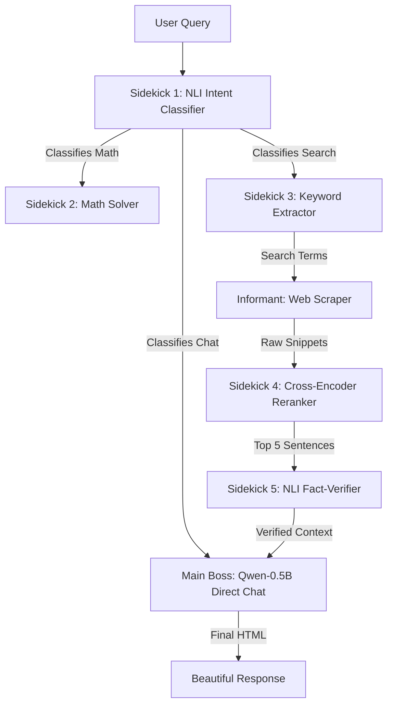

# Know-It-All: local CPU AI Agent & Webcrawler

Know-It-All is a desktop system tray widget that provides instant, high-quality, local Retrieval-Augmented Generation (RAG) answers. It runs entirely on your local CPU by orchestrating a **Boss-and-Sidekicks** agentic NLP pipeline.

---

## 1. Architecture

The system features a Python D-Bus backend service and a PyQt5 system tray widget. It is designed to run in under 1.5GB of RAM with low CPU latency.



### The Sidekicks (Context Preprocessors)
1.  **Sidekick 1 (NLI Intent Classifier):** Uses `cross-encoder/nli-distilroberta-base` to determine if a query is a math calculation, conversational prompt, or web search.
2.  **Sidekick 2 (Math Solver):** Safely parses and evaluates mathematical expressions.
3.  **Sidekick 3 (Keyword Extractor):** Cleans stop-words and extracts core search terms from the query.
4.  **Sidekick 4 (Semantic Reranker):** Tokenizes context and uses `ms-marco-MiniLM-L-6-v2` to extract the most relevant sentences.
5.  **Sidekick 5 (NLI Fact-Verifier):** Verifies facts and removes contradictions using Natural Language Inference.

### The Main Boss (Generator)
*   **Qwen2.5-0.5B-Instruct:** Generates a conversational, cohesive final answer using the preprocessed context.

---

## 2. Build and Installation

### Prerequisites
Install the required system libraries:
```bash
sudo apt update
sudo apt install python3 python3-pip python3-gi gir1.2-glib-2.0 virtualenv
```

### Packaging
To build the Debian package (`.deb`):
```bash
./packaging/build_deb.sh
```

### Running Manually
To run the D-Bus backend service manually:
```bash
cd backend
python3 crawler_service.py
```

To run the PyQt5 system tray application:
```bash
python3 frontends/lxqt/knowitall_lxqt_tray.py
```